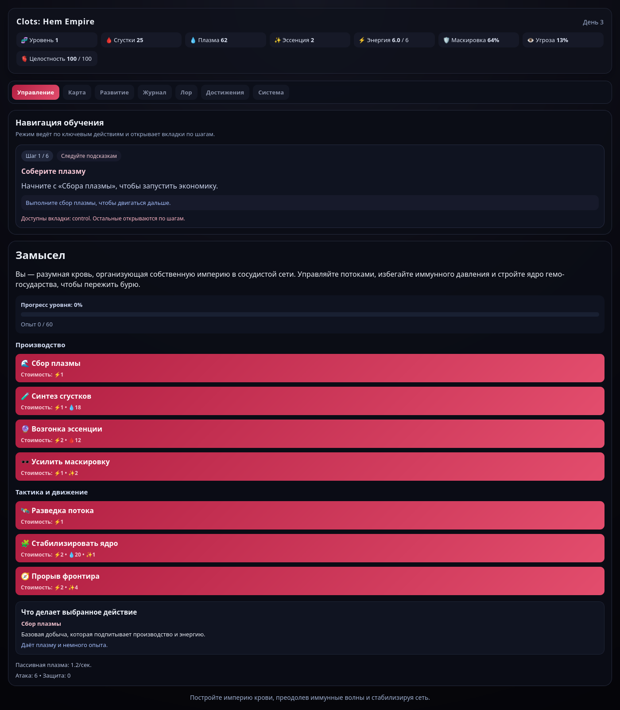

<p align="center">
  
</p>

# Clots: Hem Empire

**Clots: Hem Empire** — атмосферная стратегическая игра о разумной системе крови, которая
строит собственную цитадель в сосудистой сети. Вы управляете потоками, ресурсами и
доктринами, раскрывая дерево развития и противостоя иммунному давлению.

## Ключевые особенности
- **Явный режим обучения.** Ведёт за руку по всем вкладкам, блокирует несвоевременные
  действия и раскрывает механику шаг за шагом.
- **Система достижений.** Награды за ключевые этапы и экономический прогресс.
- **Дерево развития.** Ветки модулей, доктрин и технологий добычи с подуровнями.
- **Сложная экономика.** Режимы добычи, улучшения эффективности и риск-менеджмент.
- **Тактический бой.** Пошаговые столкновения с уникальными намерениями врагов.
- **Система сохранений.** Экспорт/импорт прогресса через код.

## Игровые системы
### Режим обучения
- Включён по умолчанию.
- Показывает текущую цель и блокирует неактуальные вкладки.
- Можно отключить вручную и включить снова без потери прогресса.

### Экономика и добыча
- **Режимы добычи** (например, импульсный или скрытый) влияют на прибыль,
  угрозу и маскировку.
- **Технологии добычи** улучшают выход ресурсов и снижают затраты.
- **Ресурсная цепочка:** плазма → сгустки → эссенция.

### Модули цитадели
- Разблокируются в ветках и усиливаются до 3 уровней.
- Дают пассивные бонусы: атака, защита, маскировка, энергия и целостность.

### Доктрины развития
- Открываются как дерево с ветками (агрессия, фортификация, поток).
- Каждая доктрина имеет уровни и отдельные бонусы.
- В активной доктрине — глобальные усиления ядра.

### Достижения
- Фиксируют ключевые события (первые победы, рост экономики, завершение обучения).
- Отображаются отдельной вкладкой, с прогресс-барами для накопительных целей.

## Управление
- **Управление:** активные действия, режим добычи, основные показатели.
- **Карта:** исследование секторов и запуск боевых событий.
- **Развитие:** модули, доктрины и технологии добычи.
- **Бой:** пошаговый контур с активными умениями.
- **Журнал:** лог событий и оперативные уведомления.
- **Система:** сохранения, FAQ, настройки обучения.

## Запуск проекта
### Установка
```bash
npm install
```

### Режим разработки
```bash
npm run dev
```

### Сборка релиза
```bash
npm run build
```

### Предпросмотр сборки
```bash
npm run preview
```

## Технологии
- **Vue 3 + Vite**
- **TypeScript**
- **CSS-стилизация под sci-fi эстетикой**

## Структура проекта
```
src/
  composables/    # игровая логика и состояние
  styles/         # базовые и игровые стили
  views/          # экраны и UI
```

## Релизная подготовка
Проект уже содержит:
- полное дерево развития (модули, доктрины, добыча),
- достижения и явный режим обучения,
- систему сохранений,
- готовую UI-архитектуру для расширения контента.

Если хотите дополнительно усилить релиз, можно добавить:
- новые ветки доктрин и модулей,
- дополнительные сценарные события,
- расширенные ачивки и ежедневные испытания.
