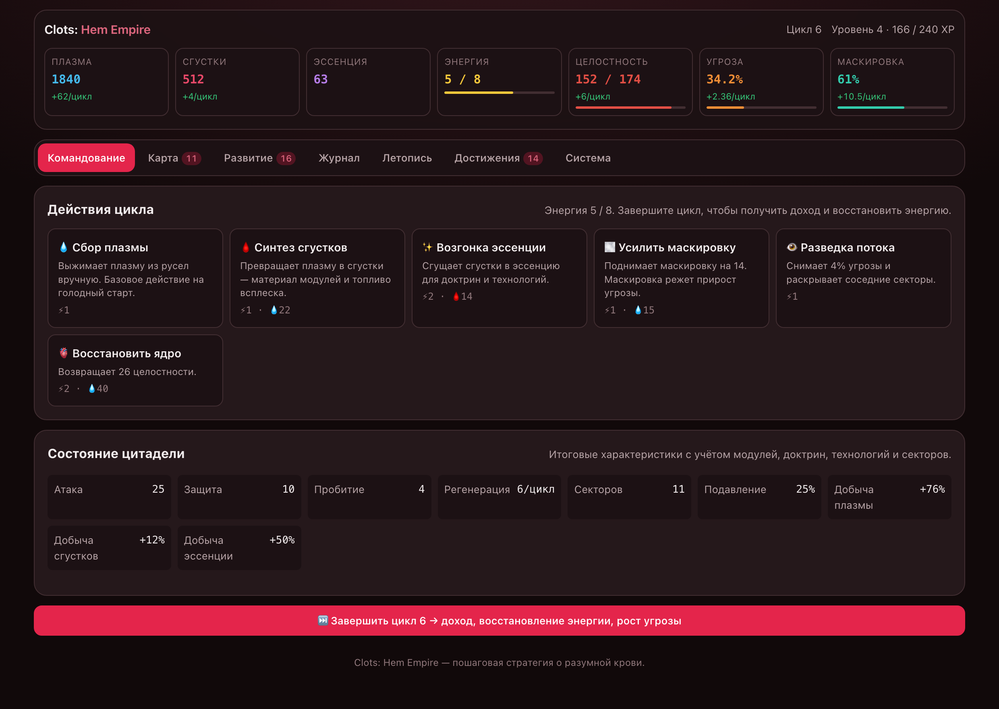
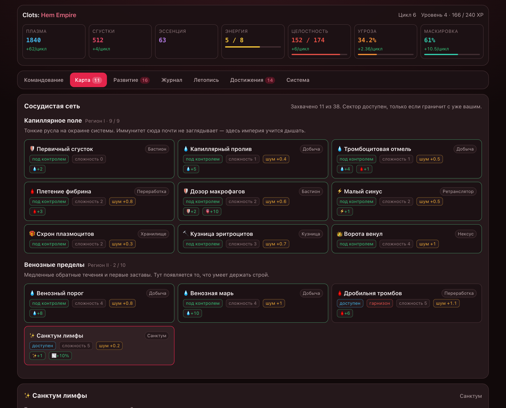

<h1 align="center">Clots: Hem Empire</h1>

<p align="center">
  Пошаговая стратегия о разумной крови, которая строит собственную империю
  в сосудистой сети — и однажды доходит до разума, который её носит.
</p>

<p align="center">
  <b>Telegram Mini App</b>
</p>

<p align="center">
  
  
  
  
  
</p>

<p align="center">
  
  &nbsp;&nbsp;
  
</p>

---

## О чём игра

Вы — сгусток, который научился помнить себя. Из одного капилляра нужно вырастить
империю: захватывать секторы сосудистой сети, строить цитадель, выбирать путь
развития и переживать иммунные рейды. Финал — Тронный синус в кортикальном ядре.

**Центральный конфликт:** каждый захваченный сектор приносит доход, но добавляет
«шум» — постоянный прирост угрозы. Чем больше держите, тем громче звучите, тем
чаще приходят рейды. Расширяться бесплатно нельзя никогда.

## Telegram Mini App

Игра запускается **только внутри Telegram** — [@clots_hembot](https://t.me/clots_hembot).
Оттуда она берёт тему, тактильный отклик, безопасные зоны и управление окном.
При открытии по прямой ссылке в браузере показывается экран с переходом в
Telegram: браузерного режима нет.

**Что используется из платформы**

| Возможность                              | Как применяется                                                    |
| ---------------------------------------- | ------------------------------------------------------------------ |
| `ready` / `expand`                       | Окно сразу разворачивается на весь экран                           |
| `disableVerticalSwipes`                  | Свайп вниз не закрывает игру при прокрутке длинных списков         |
| `safeAreaInset` / `contentSafeAreaInset` | Отступы под вырезы и шапку Telegram, синхронно с `viewportChanged` |
| `HapticFeedback`                         | Отклик на действия, удары, криты, урон, достижения и ошибки        |
| `themeParams` / `colorScheme`            | Режим «Авто» следует за темой Telegram                             |
| `setHeaderColor` / `setBackgroundColor`  | Шапка и фон Telegram красятся под тему игры                        |
| `BackButton`                             | Системная «Назад» возвращает на главную вкладку                    |
| `lockOrientation`                        | Ориентация не переключается посреди боя                            |

Всё это опционально: на старом клиенте или вне Telegram вызовы превращаются
в no-op, и игра работает дальше.

### Как подключить бота

1. В [@BotFather](https://t.me/BotFather) создайте бота и выполните `/newapp`.
2. Укажите URL мини-приложения — адрес GitHub Pages этого репозитория.
3. Соберите проект со ссылкой на бота, чтобы её показывал экран запуска:

```bash
VITE_TELEGRAM_BOT_URL="https://t.me/ваш_бот/имя_приложения" npm run build
```

Ссылка по умолчанию — `https://t.me/clots_hembot`, задана в [src/config.ts](src/config.ts).

### Отладка в браузере

Проверять каждое изменение внутри Telegram непрактично, поэтому есть скрытый
обход гейта: `?playtest=hem` в адресе. Режим запоминается на вкладку, в
интерфейсе никак не отображается и обычному игроку недоступен — по обычной
ссылке он видит только переход в Telegram.

```
https://diehlwierce.github.io/clots/?playtest=hem
```

## Как это играется

**Цикл — это ход.** Энергия (по умолчанию 6) — очки действий на цикл. Потратили —
завершайте цикл: приходит доход с секторов, энергия восстанавливается полностью,
угроза растёт, и с вероятностью, зависящей от угрозы, приходит рейд.

| Система              | Что делает                                                                                                                                      |
| -------------------- | ----------------------------------------------------------------------------------------------------------------------------------------------- |
| **Карта**            | 38 секторов в графе из 4 регионов. Захват возможен только рядом с уже своим сектором. Регион открывается победой над нексусом предыдущего.      |
| **8 типов секторов** | Добыча, переработка, санктум, ретранслятор, бастион, хранилище, кузница, нексус — у каждого своя механика, а не только иконка.                  |
| **Бой**              | Пошаговый. Противник **всегда показывает следующее намерение**. 19 архетипов с бронёй, щитами, регенерацией и уязвимостью к конкретному приёму. |
| **Развитие**         | 27 модулей в 5 ветках, 15 технологий в 3 ветках.                                                                                                |
| **Доктрины**         | Три взаимоисключающих пути: Разоритель (урон), Хранитель (выживание), Ткач (экономика и скрытность). Выбор необратим.                           |
| **Угроза и рейды**   | Маскировка снижает прирост угрозы, но не более чем на 75% — давление не отключается никакой сборкой.                                            |
| **Летопись**         | 12 глав, открывающихся по ходу партии, а не выложенных стеной на старте.                                                                        |
| **Достижения**       | 32 штуки, включая накопительные и секретные.                                                                                                    |

### Ключевые тактики

- «Экранирование» врага отвечается **Вскрытием** — оно срывает щит целиком.
- «Тяжёлый выпад» отвечается **Щитом**, но глухая оборона проигрывает гонку урона.
- У каждого врага есть уязвимость к конкретному действию — урон ×1.5.
- Перед экспансией сбивайте угрозу: рейд, пришедший сразу после штурма, добьёт.

## Технологии

| Слой        | Стек                                                                  |
| ----------- | --------------------------------------------------------------------- |
| Движок игры | TypeScript, чистые функции, детерминированный ГСЧ (mulberry32)        |
| Состояние   | Zustand + Immer, единый редьюсер `reduce(state, action)`              |
| Интерфейс   | React 19, CSS с дизайн-токенами (без UI-фреймворков)                  |
| Сборка      | Vite 7                                                                |
| Качество    | TypeScript strict, ESLint 9 (typed), Prettier, Vitest, GitHub Actions |

### Архитектура

```
src/
  engine/            # игровой движок: не знает ни про React, ни про DOM
    types.ts         # доменные типы
    balance.ts       # ВСЕ числа баланса в одном месте
    rng.ts           # детерминированный ГСЧ
    content/         # карта, враги, модули, доктрины, технологии, лор
    systems/         # бой, угроза
    save/            # кодек, схема-валидатор, миграции
    selectors.ts     # производные характеристики
    engine.ts        # reduce(state, action) → { state, notices }
  telegram/          # SDK Mini App: инициализация, таптик, тема, вьюпорт
  store/             # тонкая обёртка Zustand над движком
  ui/                # React-компоненты
  styles/            # токены и стили
tests/               # 209 тестов на движок, сейвы, Telegram, переводы и диагностику
e2e/                 # 6 сценариев интерфейса на Playwright
```

Движок — чистая функция от состояния и действия. Вся случайность идёт через
`(seed, rngCursor)`, поэтому партия воспроизводима, а бои тестируются без моков.
UI ничего не вычисляет сам: он только рисует состояние и отправляет действия.

## Запуск

```bash
npm install
npm run dev
```

| Команда                     | Что делает                                       |
| --------------------------- | ------------------------------------------------ |
| `npm run dev`               | Дев-сервер                                       |
| `npm run build`             | Проверка типов + продакшен-сборка                |
| `npm run test`              | Тесты движка                                     |
| `npm run lint`              | ESLint с типовыми правилами                      |
| `npm run verify`            | Полный прогон: типы → линтер → тесты → сборка    |
| `npm run e2e`               | E2E-сценарии интерфейса (Playwright)             |
| `npm run balance`           | Балансный прогон: три политики, отчёт по забегам |
| `npm run balance:mutations` | Замер мутаций по отдельности                     |
| `npm run test:balance`      | Медленные проверки жизнеспособности стилей       |
| `npm run deploy`            | Сборка и публикация на GitHub Pages              |

## Сохранения

Прогресс сохраняется автоматически в `localStorage` (отложенно, в простое браузера)
и синхронизируется через **CloudStorage Telegram**: партия выгружается в конце
каждого цикла и подтягивается при запуске, поэтому её можно продолжить с другого
устройства. Конфликт решается по номеру цикла — побеждает более поздняя партия,
а облако пишется поколениями, чтобы прерванная запись не смешала две партии.

Раз в десять циклов делается снимок в один из трёх автослотов — точка возврата
на случай ошибочного сброса. Если запись на устройство не удалась, игра честно
об этом сообщает, а не теряет прогресс молча.
Код сохранения — компактный URL-safe base64 **около 1.5 КБ**: в него попадают только
идентификаторы и числа, а весь контент остаётся в коде. Благодаря этому обновление
баланса доходит до уже играющих, а не остаётся навсегда замороженным в сейве.

Любой загружаемый сейв считается недоверенным: он проходит проверку версии,
миграции и полную санитизацию — неизвестные идентификаторы отбрасываются, числа
клампятся, `NaN` невозможен.

## Управление вкладками

| Вкладка       | Что внутри                                        |
| ------------- | ------------------------------------------------- |
| **Штаб**      | Действия цикла и итоговые характеристики цитадели |
| **Карта**     | Регионы, секторы, захват и штурм                  |
| **Развитие**  | Модули, доктрины, технологии                      |
| **Хроника**   | Журнал, летопись и достижения                     |
| **Настройки** | Тема, тактильный отклик, сохранения, правила      |

Ни одна вкладка не блокируется: интерфейс доступен целиком в любой момент партии.

## Что изменилось во второй версии

Игра переписана с нуля. Идея сохранена полностью, всё остальное заменено.

**Устранённые критические дефекты первой версии:**

| Было                                                                                                                | Стало                                                                                                |
| ------------------------------------------------------------------------------------------------------------------- | ---------------------------------------------------------------------------------------------------- |
| Смерть во время обучения запирала сейв навсегда: сообщение «запустите сброс» при заблокированной вкладке со сбросом | Обучение — только подсказка, оно ничего не блокирует. Перезапуск живёт в модальном окне поверх всего |
| Один модуль навсегда отключал прирост угрозы; счётчик уходил в −1068%                                               | Снижение мультипликативно и ограничено 75%, шкала жёстко зажата в [0, 100]                           |
| «Маскировка» в шапке не влияла ни на что                                                                            | Маскировка — основной рычаг управления угрозой                                                       |
| Код сохранения — 65 КБ текста для ручного копирования                                                               | ~1.5 КБ: сейв хранит идентификаторы, а не описания                                                   |
| Импорт сейва не проверял ничего: `NaN` и подделанные поля попадали в состояние                                      | Версия, миграции, схема-валидатор, кламп всех чисел                                                  |
| Полное состояние сериализовалось в `localStorage` каждую секунду                                                    | Пошаговый цикл + отложенная запись в простое браузера                                                |
| Манифест PWA отдавал 404                                                                                            | Манифест на месте, установка работает                                                                |
| Ни одного стиля фокуса — игра непроходима с клавиатуры                                                              | Видимый фокус на всём интерактивном                                                                  |
| 8 типов секторов с одним поведением, карта — линейная очередь                                                       | 8 типов с разными механиками, карта — граф с выбором маршрута                                        |
| Нет тестов, CI, tsconfig и lockfile                                                                                 | 96 тестов, CI на GitHub Actions, strict-режим, зафиксированный lockfile                              |

## Языки

Русский и английский: интерфейс, весь контент и летопись. Язык берётся из
Telegram, затем из системы, и меняется вручную в настройках. Русский текст
в `src/engine/content` — эталон, переводы накладываются поверх по
идентификаторам, поэтому отсутствующая строка остаётся русской, а не исчезает.

## Что дальше

Все 17 пунктов [docs/ROADMAP.md](docs/ROADMAP.md) реализованы; документ
сохранён как история решений.

[docs/OPTIMIZATION.md](docs/OPTIMIZATION.md) — 18 пунктов оптимизации, тоже
реализованы: главный чанк похудел со 129 до 52 КБ в сжатом виде, первый экран
появляется за 425 мс, оптимизации удерживаются бюджетом размера в CI.

Баланс проверяется измерением, а не на глаз:

```bash
npm run balance 24
```

Текущая картина: агрессивная игра выигрывает в 50% забегов, экономическая
в 38%, осторожная в 63%. Разброс между мутациями — 42 процентных пункта
при минимуме 21%.
